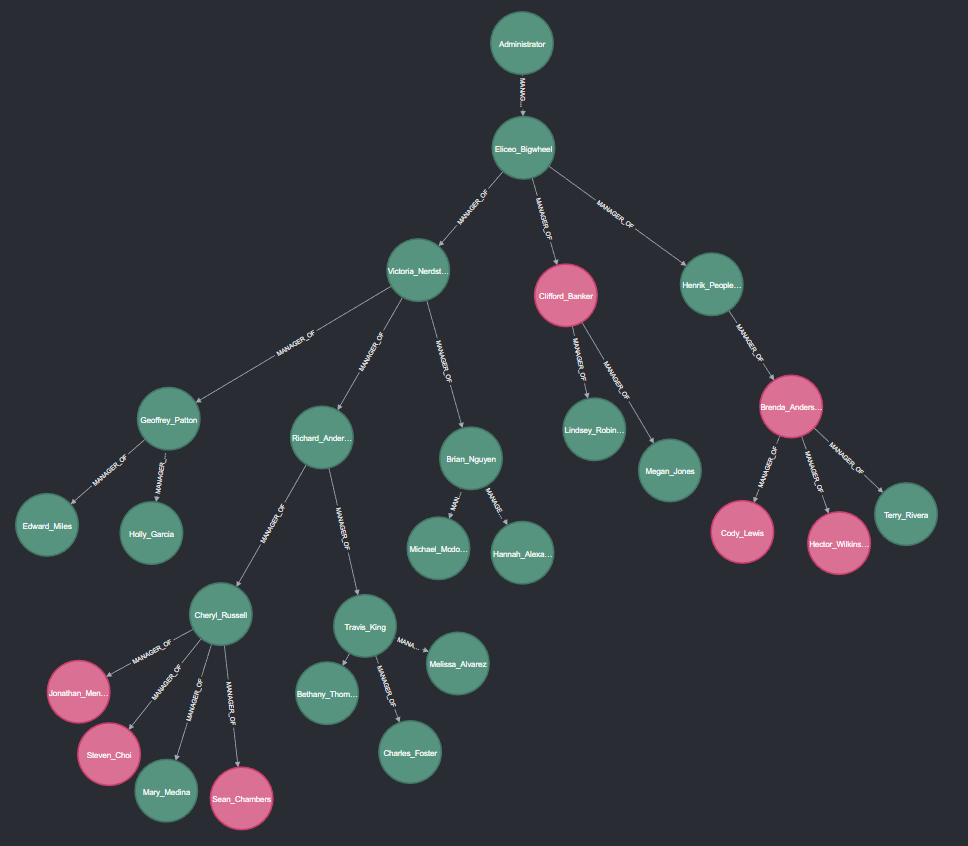
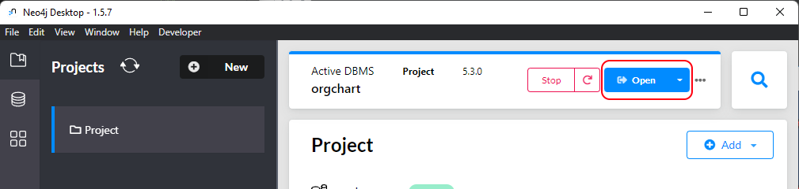
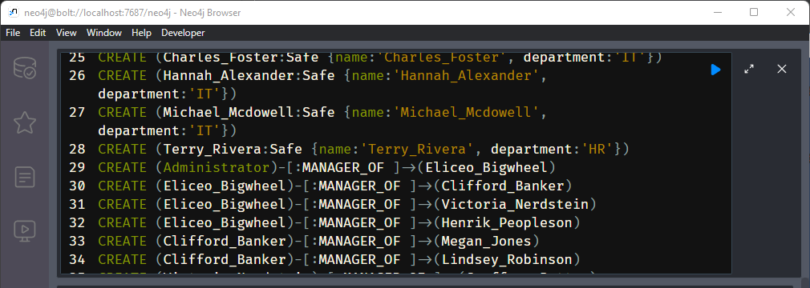
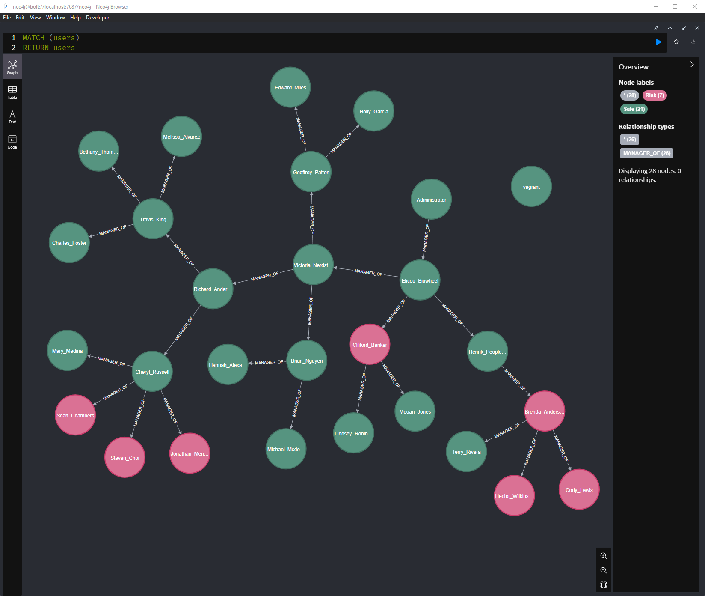
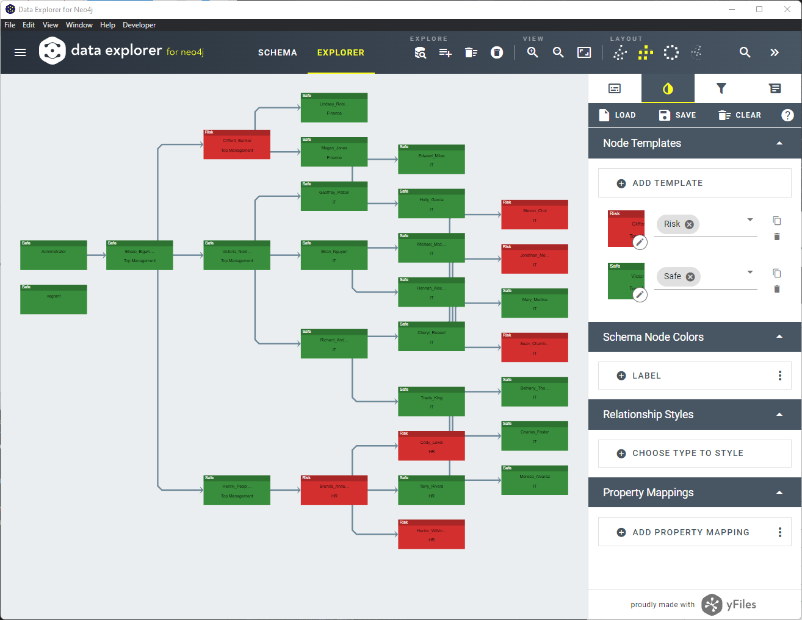

# Compromised Org Chart Generator



## Overview
Active Directory is used by organization as the identity provider.  
It contains information of all employees including their names, job titles, departments, and their managers.  

Password audits can help to discover weaknesses and risks.  
You might try password spraying of a small number of passwords.  
Or you can run dictionary attacks with hashcat against the user hashes.  
You also get breach information from services like [https://haveibeenpwned.com](https://haveibeenpwned.com/DomainSearch)  
In those cases you will get a list of users at risk. This script helps you to visualize which departments or areas are at risk.  

The knowledge of clear text passwords allow a threat actor to authenticate as the user and will often not raise any alerts.  

This repository helps you to visualize you organization by drawing an Org Chart based on the manager attribute in Active Directory.  
It will then import a list of compromised users and combine the information.  
It will generate a Org Chart where you can see the compromised users and help you to easily spot departments where password hygiene is not ideal. You can provide additional awareness training to those departments.  

## Requirements
This powershell script will run on a Active Directory joined computer.  
It will use Active Directory powershell modules to query all AD user objects. Typically this can be done by every user in the environment.  
Optionally it will import the file compromised_users.csv file and mark those object.  

To visualize the information neo4j Desktop is used. The powershell script generates the needed cypher script.

## Run Powershell Script
- run powershell
- Set-ExecutionPolicy RemoteSigned
- optional: edit compromised_users.csv list and add all users where passwords are insecure or leaked
- ./create_orgchart.ps1

The script accepts to parameters. 
-OutputFile            -> Cypher statements will be written to this file. Default: ".\cypher.txt"
-CompromisedUsersFile  -> A list of Compromised user accounts (SamAccountName). Default: ".\Users_Compromised.csv"
    [string]$CompromisedUsersFile = 

## Create Neo4j Desktop database
- https://neo4j.com/download/
- Projects -> New -> Create Project
- add -> add local DBMS -> name: orgchart -> create
- orgchart -> start
- orgchart -> open



## Import Cypher Script
- paste script into the command line on the top of the window



## Query database
run the following query
``` 
MATCH (employee)
RETURN employee
```



You can find other example queries in the file [cyper_search_queries.md](cyper_search_queries.md)

For large organization you need to increase the Initial Node Display variable in the settings of Neo4j. By default the queries show 300 nodes. 

You can also use other apps like yFiles Neo4j Explorer to have different layouts


## Demo
This repository contains a Vagrant file.  
You can install Virtualbox and Vagrant on your computer and run:
``` 
vagrant up
``` 

It will
- download a Windows Server image
- install Active Directory
- create a forest
- create user accounts from a CSV file
- create the Cypher statements from the AD database

This demo environment should help you to try it out in a controlled environment before you run it against a large enterprise environment.  

There is also a example database creation script in case you do not want to spin up a full AD environment.  
Just install Neo4j Desktop and use the file demo/example_cypher_creation_script.txt to build the database.  
